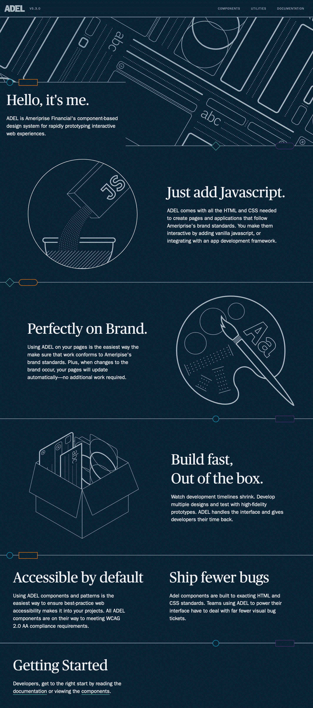
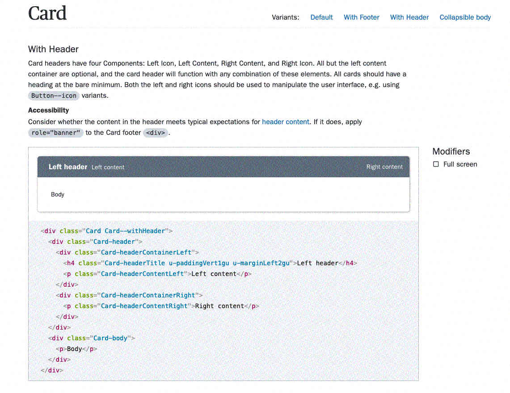
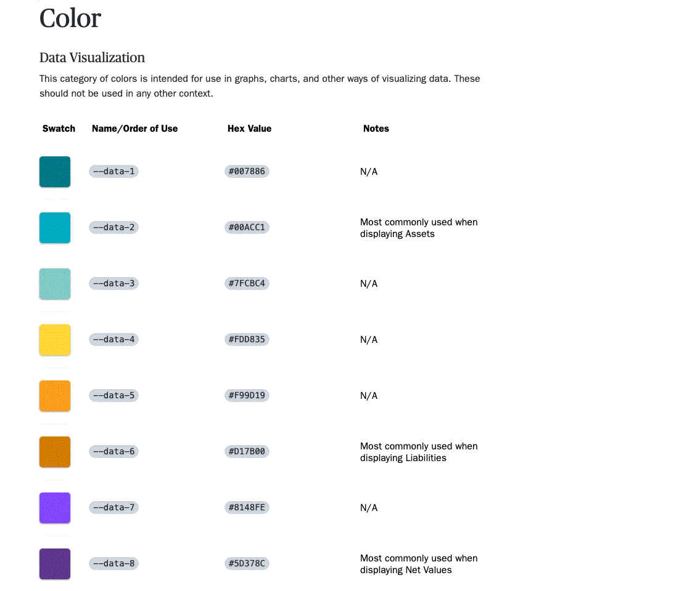
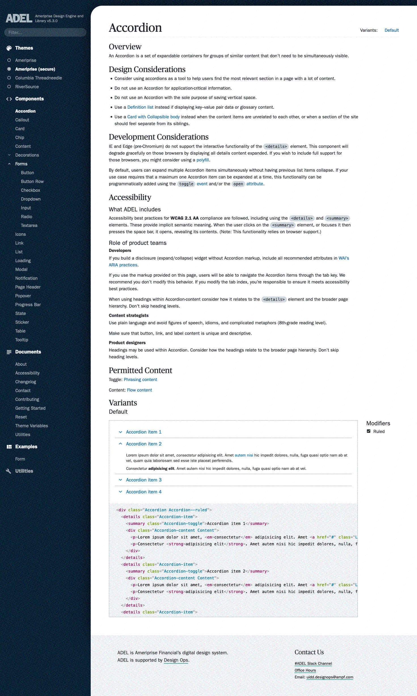
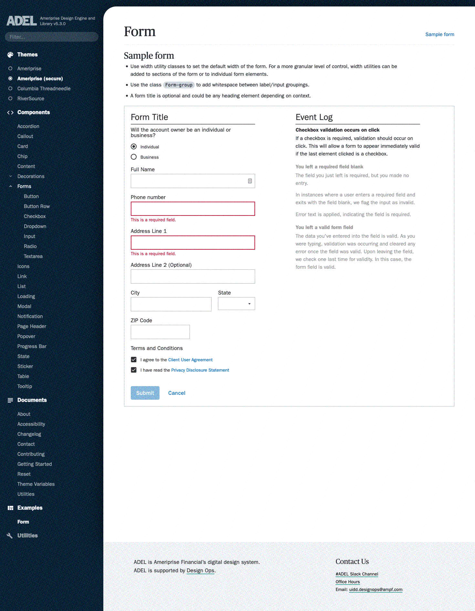

  

  ## Scaling design at a fortune 250 financial institution

  Over the course of four years, I've been a core contributor to grassroots design system at a major financial institution. In addition to developing and designing the components themselves, I've been responsible for the design system's interface, change management, and release communications.

### Details

ADEL's Card component. Shown is a component example, description, and code block.

  

ADEL's Design Token table, showing a portion of the data visualization color palette.

  

A full ADEL component page. Note how much focus we place on *education* and *communication* in our component documentation pages.

  

ADEL's example form, complete with an event log that shows what validations run on a given form event.

  

ADEL's text utility page, which I designed so developers can have a clear understanding of what text utility classes are available in the system, and how they modify the appearance of a text string.

  

### Impact

* ADEL is currently used by **22 product teams** at this financial institution
* ADEL has **four CSS themes** available for different branches of the company
* In the 2020 ADEL developer satisfaction survey, **90% of respondents were very satisfied or better** with the design system
