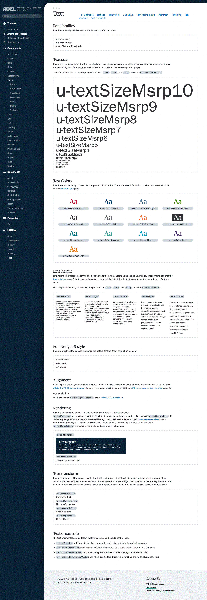

  

## Scaling design at a fortune 250 financial institution

Over the course of four years, I've been a core contributor to grassroots design system at a major financial institution. In addition to developing and designing the components themselves, I've been responsible for the design system's interface, change management, and release communications.

### Details

ADEL's Card component. Shown is a component example, description, and code block.

ADEL's Design Token table, showing a portion of the data visualization color palette.

A full ADEL component page. Note how much focus we place on *education* and *communication* in our component documentation pages.

ADEL's example form, complete with an event log that shows what validations run on a given form event.

ADEL's text utility page, which I designed so developers can have a clear understanding of what text utility classes are available in the system, and how they modify the appearance of a text string.

### Impact

ADEL is currently used by 22 product teams at this financial instution, and has four CSS themes available. In the 2020 ADEL developer satisfaction survey, 90% of respondents were very satisfied or better with the design system.
